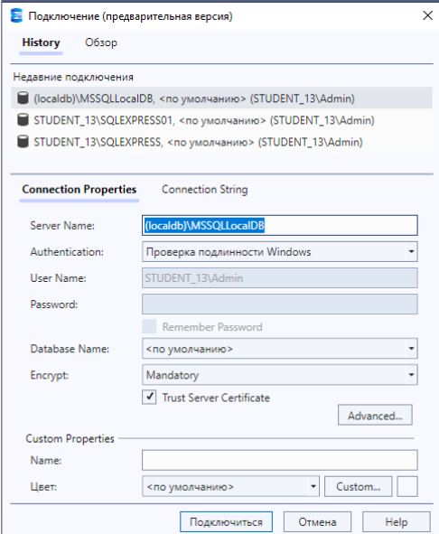
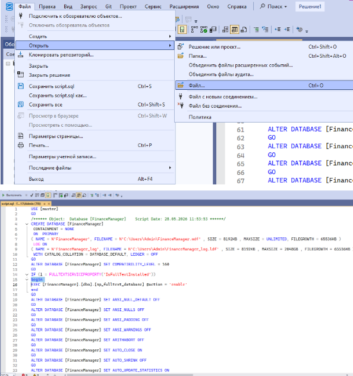
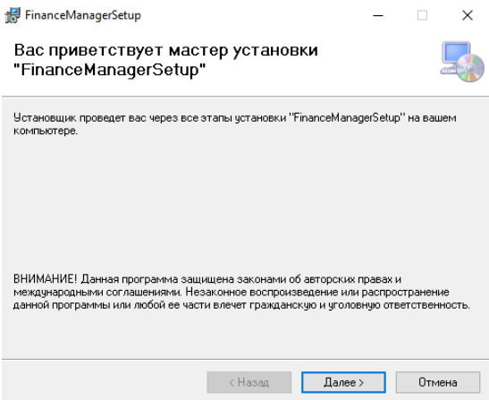
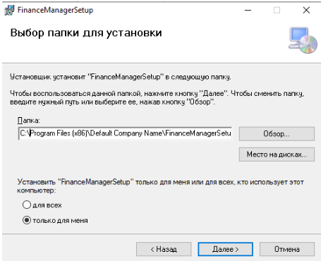
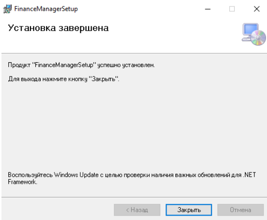
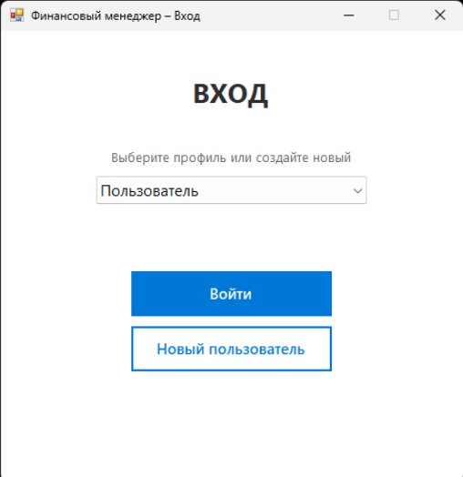

# Руководство по инсталляции приложения «Финансовый менеджер»

Для успешного запуска проекта вам понадобятся:
1. Среда **SQL Server Management Studio (SSMS)** для развертывания базы данных.
2. Установочные файлы клиентского приложения (`setup.exe` и `FinanceManagerInstaller.msi`).

---

## Шаг 1. Развертывание базы данных

В первую очередь необходимо подготовить базу данных. 

1. Запустите **SSMS** и выполните подключение к вашему локальному серверу баз данных.

> **Рисунок Г.1 – Подключение к серверу базы данных**
> 
> 

2. После успешного подключения откройте в SSMS файл `script.sql`, который поставляется вместе с проектом в корневой папке.
3. Нажмите кнопку **«Выполнить» (Execute)** на верхней панели управления. Это автоматически создаст необходимую базу данных, таблицы и связи для работы программы.

> **Рисунок Г.2 и Г.3 – Выполнение скрипта базы данных**
> 
>  

---

## Шаг 2. Установка клиентского приложения

Когда база данных успешно создана, можно переходить к установке самой программы на компьютер.

1. Запустите файл `FinanceManagerInstaller.msi` из папки инсталлятора. На экране откроется мастер установки.

> **Рисунок Г.4 – Установка приложения (Шаг 1)**
> 
> 

2. На начальных вкладках мастера ознакомьтесь с информацией. При необходимости вы можете изменить стандартный путь и выбрать нужную папку для установки. После этого нажмите кнопку **«Далее» (Next)**.

> **Рисунок Г.5 – Выбор папки (Шаг 2)**
> 
> 

3. В следующем окне установщик сообщит, что все готово к началу копирования. Нажмите кнопку **«Установить» (Install)** и дождитесь окончания процесса. 
4. По завершении операции появится окно с подтверждением, что инсталляция успешно завершена. Нажмите **«Закрыть» (Close)**.

> **Рисунок Г.6 – Завершение инсталляции**
> 
> 

---

## Шаг 3. Первый запуск

После завершения инсталляции на вашем рабочем столе появится ярлык **«Финансовый менеджер»**. 

Для начала работы:
* Дважды кликните по ярлыку на рабочем столе. 
* Приложение запустится и автоматически установит связь с развернутой на первом шаге локальной базой данных SQL Server.

> **Рисунок Г.7 – Запуск программы**
> 
> 

Инсталляция выполнена успешно. Приложение готово к работе!